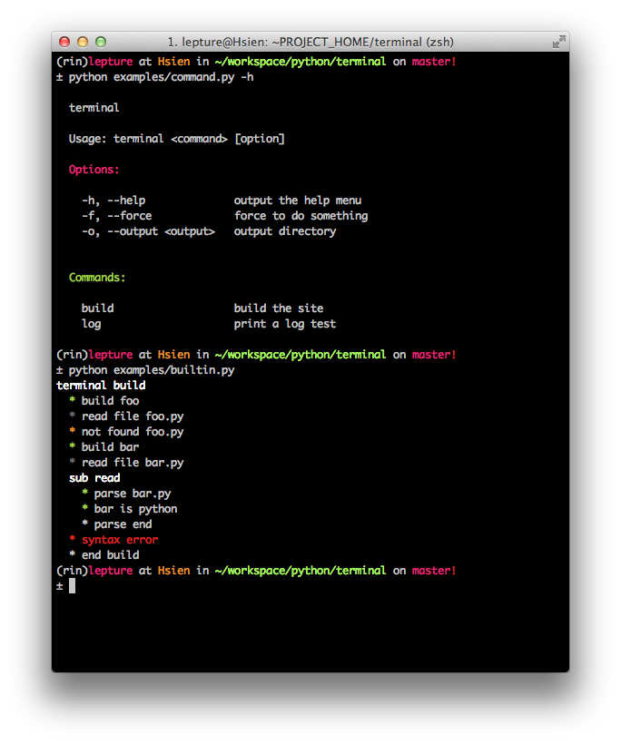

Advanced Usage
==============

This document covers some of Terminal more advanced features.

.. module:: terminal

Colorful Life
-------------

If you are not satisfied with 8-bit colors, we can have more.
The :func:`colorize` function can paint 256 colors if your terminal supports 256 colors::

    >>> from terminal import colorize
    >>> print colorize('text', 'red')        # color name
    text
    >>> print colorize('text', '#ff0000')    # hex color with #
    text
    >>> print colorize('text', 'ff0000')     # hex color without #
    text
    >>> print colorize('text', (255, 0, 0))  # rgb color
    text

.. note::

    If your terminal can not show 256 colors, maybe you should change your terminal
    profile, claim that it supports 256 colors.

We can also paint the background of the text with :func:`colorize`::

    >>> print colorize('text', 'ff0000', background=True)

The source engine of :func:`colorize`, :func:`red`, :func:`cyan` and etc. is
:class:`Color` object. Let's dig into it::

    >>> from terminal import Color
    >>> s = Color('text')
    >>> s.fgcolor = 1
    >>> print s
    text
    >>> s.bgcolor = 2
    >>> print s
    text
    >>> s.styles = [1, 4]
    >>> print s
    text

But it is not fun to play with ANSI code, we like something that we can read::

    >>> s = Color('text')
    >>> s.fgcolor = 'red'
    >>> s.bgcolor = 'green'
    >>> print s

This is not good enough, if we want to paint a text in red text, green background,
bold and underline styles, we could::

    >>> from terminal import *
    >>> print underline(bold(green_bg(red('text'))))
    text
    >>> # this is a disaster, we can do better
    ...
    >>> s = Color('text')
    >>> print s.red.green_bg.bold.underline
    text

.. important::

    If you are colorizing non-ASCII charaters, and you are not on Python 3.
    Please do wrap the charaters with **u**::

        >>> terminal.red(u'中文')

Decorator Command
-----------------

:class:`Command` is inspired by `commander.js`_, with the magic power of Python,
we can do better. Let's have a look at the basic usage of :class:`Command`::

    from terminal import Command

    program = Command('pip', description='.....', version='1.2.1')
    program.option('--log [filename]', 'record the log into a file')
    program.option(
        '--timeout [seconds]',
        'the socket timeout, default: 15',
        resolve=int
    )

    # let's create a subcommand
    installer = Command('install', description='install packages')
    installer.option('-t, --target [dir]', 'Install packages into dir')

    # let's add the subcommand
    program.action(installer)

    program.parse()

The magic of decorator makes it easier to add a subcommand::

    @program.action
    def install(target=None):
        """
        install packages

        :param target: Install packages into dir
        """
        do_something(target)

The decorator will create a subcommand for you automatically. It will get the options
from parameters, it will get the description from the docstring.

The example above equals something like::

    def install(target=None):
        do_something(target)

    installer = Command('install', description='install packages', func=install)
    installer.option('-t, --target [target]', 'Install packages into dir')
    program.action(installer)

The option ``-t, --target [target]`` is generated from params and docstring. You can
define the option yourself::

    @program.action
    def install(target=None):
        """
        install packages

        :param target: Install packages into dir
        :option target: -g, --target [dir]
        """
        do_something(target)

.. _`commander.js`: https://github.com/visionmedia/commander.js

The ``arguments`` parameter was added in 0.4.0, and it can be generated from a function::

    @program.action
    def install(target):
        ""install a package"""
        do_something(target)

The usage will be::

    $ pip install <target>

If the ``target`` has a description, it will be a required option::

    @program.action
    def install(target):
        """
        install packages

        :param target: Install packages into dir
        """
        do_something(target)

The usage will be::

    $ pip install -t <target>

Options
~~~~~~~

If you defined a subcommand with the decorator magic, :class:`Command` will auto detect
if the option is required or not, if it is a Boolean or not.

If you do like the raw option, we can learn from these examples::

    # boolean, default is False
    program.option('-f, --force', 'force to do something')
    # program.force is False

    # boolean, default is True
    program.option('-C, --no-color', 'do not paint')
    # program.color is True

    # required, no default value
    program.option('-o, --output <dir>', 'output directory')

    # required, default is dist
    program.option('-o, --output <dir>', 'output directory, default: dist')
    # if it has a default value, it is optional actually.

    # optional, no default value
    program.option('-o, --output [dir]', 'output directory')

You can learn from the example that required options are surrounded by ``<>``, and
optional ones are surrounded by ``[]``. The parser can parse a default value from the
description.

Builtin Engines
---------------

We do like colorful things, but we are too lazy to do any customization. The default
one is pretty enough, (if you don't think so, let's improve it).

Get the power from **terminal.builtin**::

    from terminal.builtin import Command, log
